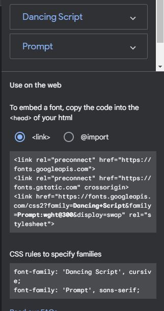
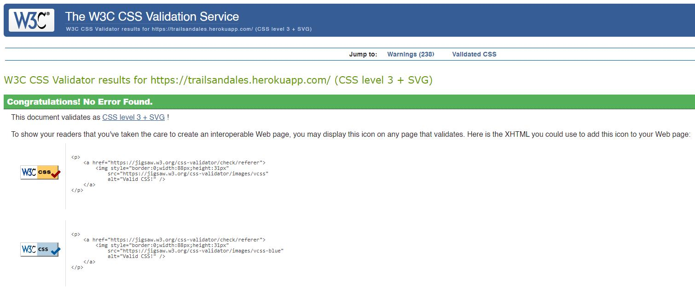
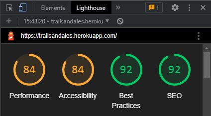

Welcome to my fourth Code Institute diploma project.

# INTRODUCTION AND OVERVIEW
For my fourth project I decided to create a blog.

'**Trails & Ales**' is a blog where I can record and share my mountain bike rides with friends and fellow mountain bikers.

# TRAILS & ALES


### **Live Project can be viewed:**  [HERE](https://trailsandales.herokuapp.com/)

### **The repository can be found here:**  [HERE](https://github.com/GaryCooper-pm/PP4-Django-project)


## INITIAL IDEA CONCEPT

* My initial idea for this project was to create a simple blog that would enable me to create posts after each ride.

* This would enable me to record and share my rides with friends and fellow cyclists.

* The blog would give them a narrative for the ride where I can share my thoughts on the trails and any pictures I may take along the way.


## TARGET AUDIENCE

* Anyone who wants to read about my cycling escapades.

* People who share a love for cycling, especially singlespeed mountain bikes

* People looking to join me on a social ride and enjoy the trails with like minded others.

#
## CONTENTS


- [DJANGO PROJECT CHECKLIST](#project-checklist)
- [USER STORY](#user-story)
- [FEATURES](#features)
    - [Wireframes](#wireframes)
    - [Models Diagram](#models-diagram)
    - [Design](#design)
- [TECHNOLOGIES](#technologies)
    - [Development](#development)
    - [Languages used](#languages-used)
    - [Frameworks, Libraries and Programs used](#frameworks-libraries-and-programs-used)
- [TESTING](#testing)
    - [Manual testing](#manual-testing)
    - [Testing User Stories](#testing-user-stories)
    - [Testing Admin User Stories](#testing-admin-user-stories)
    - [Validation](#validation)
    - [Unsolved bugs and problems](#unsolved-bugs-and-problems)
    - [Resolved bugs and problems](#resolved-bugs-and-problems)
- [FUTURE DEVELOPMENT](#future-development)
- [DEPLOYMENT](#deployment)
- [ACKNOWLEDGEMENTS](#acknowledgements)

#

## PROJECT CHECKLIST

### **The complete Project checklist can be found:** [HERE](https://github.com/users/GaryCooper-pm/projects/3/views/1)

## USER STORY

I used the agile methodology tool:

* GitHub Projects was utilised to create and manage a Kanban board, for planning and implementing the project's functionality.


- As a Site User I can view a list of posts so that I can easily select one to view.
- As a Site User I can view a list of posts so that I can select one to read.
- As a Site User I can click on a post so that I can read the full content.
- As a Site User / Admin I can view the number of likes on each post so that I can see which is the most popular or viral.
- As a Site User / Admin I can view comments on an individual post so that I can read the conversation.
- As a Site User I can register an account so that I can comment and like.
- As a Site User I can leave comments on a post so that I can be involved in the conversation.
- As a Site User I can like or unlike a post so that I can interact with the content.
- As a Site Admin I can create, read, update and delete posts (CRUD) so that I can manage my blog content both from the front and back-end.
- As a Site Admin I can create draft posts so that I can finish writing the content later.
- As a Site Admin I can create categories so that I can categorise posts.
- As a Site Admin I can approve or disapprove comments so that I can filter out objectionable comments.

---

## FEATURES


### Wireframes:

* The project was initially visualised using Balsamiq.
* Home Page


* Blog Post Page


* Register Page


* Sign In Page


* Registered User Comment Page


* Mobile Home Page


* Mobile Blog Post Page


* Mobile Register Page


* Mobile Sign In Page


### MODELS DIAGRAM

- Models Diagrams:


### DESIGN

- [Google Fonts](https://fonts.google.com/) was used for the website's fonts.



__Navigation Bar__


- Navigation is a fully responsive feature on all pages, it includes links on the site's Logo (displaying to the left within the bar), Home, Register and Login pages.


- The 'Add Post' and 'Add Category' links only show up for superusers when logged in.
- The navigation looks the same on each page to allow for easy navigation, taking the user through a logical journey.
- This section makes it easy for the user to learn more about the site's different sections and content.

__Welcome Section__


- A Welcome section on the home page welcomes the users to the site and lets them know what the site is about.


__Blog Posts Section__


- The Blog posts section displays six posts at a time (with featured images, authors, titles, post dates, excerpts), featuring pagination ("NEXT", "PREV" buttons show up), in case there are seven or more posts.

__Footer__


- The footer area consists of five social links for the blog (Facebook, Strava, Instagram, YouTube and GitHub - all of them, if clicked, open on a separate tab).
- Like the navigation section, the footer looks the same on each page (and features on all of the pages) to allow for easy navigation, taking the user through a logical journey.

__Blog Post Page__


- Featuring the post image, post title, post author and post date.
- If the logged in user is an admin two links "Edit" & "Delete" appear.
- Post body content, like and comment count.  The Like and Comment counters display how many users have liked and/or commented on the post.
- Only registered users can like or comment on posts.  Registered users can click on the heart icon to like or unlike the post.

__Comments Section__


- The comments section features information displayed from all users who have posted comments, such as their username, the date of the comment and the comment's content.


- If the user is logged in it will display a text field to the right, where they are able to engage with other users/the post and submit a comment.
- Comments are moderated to avoid unfriendly interactions and spam.  Once a user submits a comment the message below appears to them.


__Add Post Page__


- If the user logged in is an admin they are able to add a blog post (from both the front and backend) by simply clicking on the 'Add Post' navigation link.
- The page features a form where the user can fill out all the details for the new post, such as title, slug, author, featured image (if desired), content and whether to publish or save as a draft for editing at a later time.

__Add Category Page__


- If the user logged in is an admin they are able to add a category (from both the front and backend) by simply clicking on the 'Add Category' navigation link.
- The page features a form where the user can fill out the name of the category.  When they submit the new category they are returned to the home page and the new category is appended to the database.

__Edit Blog Post Page__


- The page features a form where, if the user logged in is an admin, they are able to Edit any of the Blog posts (both from the front and backend), by clicking on the "Edit" link in the blogs header.

__Delete Blog Post Page__


- If the user logged in is an admin, they are able to Delete any of the Blog posts (both from the front and backend), by clicking on the "Delete" link in the blogs header.

---

# TECHNOLOGIES

## DEVELOPMENT

* The project was written and tested using [Gitpod](https://gitpod.io/)
* The project uses [Github](https://github.com/) for utilising git version control
* The project was deployed via [Heroku](https://heroku.com/)

## LANGUAGES USED

- [HTML5](https://developer.mozilla.org/en-US/docs/Glossary/HTML5)
- [CSS3](https://developer.mozilla.org/en-US/docs/Web/CSS)
- [JavaScript](https://developer.mozilla.org/en-US/docs/Web/JavaScript)
- [Python3](https://developer.mozilla.org/en-US/docs/Glossary/Python)

## FRAMEWORKS LIBRARIES AND PROGRAMS USED

- [Balsamiq](https://balsamiq.com/)
  - Balsamiq was used to make desktop/mobile mockups in order to visualise the project.
- [Bootstrap](https://getbootstrap.com/)
  - Bootstrap template.
- [Cloudinary](https://cloudinary.com/)
  - Cloudinary was used to store the project's images.
- [Django](https://www.djangoproject.com/)
  - Django was used to build the app.
- [Django Allauth](https://django-allauth.readthedocs.io/en/latest/overview.html/)
  - Django allauth for account management.
- [Django Crispy Forms](https://django-crispy-forms.readthedocs.io/en/latest/)
  - Django Crispy Forms for rendering elegant DRY forms.
- [Font Awesome](https://fontawesome.com/)
  - Font Awesome was used to add icons to improve the design of the website.
- [Git](https://git-scm.com/) & [Gitpod](https://gitpod.io/)
  - Git was used for version control via the Gitpod terminal in order to commit to Git and push to GitHub.
- [GitHub](https://github.com/)
  - GitHub was used for version control.
- [Google Fonts](https://fonts.google.com/)
  - Google Fonts was used to import the fonts which are used on the website.
- [Heroku](https://heroku.com/)
  - Heroku was used for hosting and deploying the game.
- [Lucidchart](https://www.lucidchart.com/)
  - Lucidchart was used for drawing the database models.
- [PostgreSQL](https://www.postgresql.org/)
  - PostgreSQL for database management.
- [Summernote](https://summernote.org/)
  - Summernote WYSIWYG for Bootstrap.

---

# TESTING

## Manual Testing
<<<<<<< HEAD
<<<<<<< HEAD
  
=======
=======
>>>>>>> 330819ff2241fbdf7ce219a18aac21f146f44d25

## Manual Testing of User Input and Functions  
  I systematically tested all user inputs and functionality in the website to compare feedback/results against expected results.  
  Any unexpected output/outcomes were fixed.

- The results of this testing script can be found [HERE](https://docs.google.com/spreadsheets/d/1s9QWb1ZWJ50RqVrJlcIcfsypzAWEmzDRqDNGV2GRcVU/edit?usp=sharing)

<<<<<<< HEAD
>>>>>>> categories
=======
>>>>>>> 330819ff2241fbdf7ce219a18aac21f146f44d25
- All links, form submissions, admin privileges, user privileges, app functions were tested out and work as intended.

## Testing User Stories

| Action        | Acceptance Criteria           | Test Complete  |
| ------------- |:-------------:| -----:|
| View Post/s      | User is met with all posts when visiting Home Page |   Yes |
| Read individual post      | User can easily select a post to read      |   Yes |
| View number of likes | User can easily see how many likes a post has      |    Yes |
| View number of comments | User can easily see how many comments a post has.      |    Yes |
|   | All the posts display a heart icon with a number next to it      |      |
|   | (which indicate how many times the post has been liked)      |      |
| Register an account | User can easily register for an account      |    Yes |
| Comment on posts | Registered users can easily add comments to a post      |    Yes |


- As a Site User you can view a list of posts so that you can easily select one to view.
    - As soon as the user lands at the home page, they are able to see all the available blog posts.

- As a Site User you can view the number of likes on each post so that you can see which is the most popular or viral.
    - All the posts display a heart icon with a number next to it (which indicate how many times the post has been liked).

- As a Site User you can view comments on an individual post so that you can read the conversation.
    - Whenever the user is reading a post, once they scroll down to the comments section, they can read any comments that other users have left on that particular post.

- As a Site User you can register an account so that you can comment and like on posts.
    - The navigation bar is a section that makes it easy for the user to learn more about the site's different sections, and it includes a "Register" page. Once the user goes through the straightforward registration process, they are able to like and comment on different posts.

- As a Site User you can like or unlike a post so that you can interact with the content.
    - Once the user is registered, they may click on the heart icon to simply like or unlike a post.


## Testing Admin User Stories

| Action        | Acceptance Criteria           | Test Complete  |
| ------------- |:-------------:| -----:|
| Create Post/s      | Admin user is able to create a new post |   Yes |
| Create  a draft post/s      | Admin user is able to create a new post and save for later |   Yes |
| View Post/s      | Admin user is met with all posts when visiting Home Page |   Yes |
| Read individual post      | Admin user can easily select a post to read      |   Yes |
| Edit Post/s      | Admin user is able to edit a post      |   Yes |
| Delete Post/s      | Admin user is able to delete a post      |   Yes |
| Approve comments | Admin user can easily see any new comments made on a post and approve as appropriate      |    Yes |
| View number of likes | Admin user can easily see how many likes a post has      |    Yes |
| View number of comments | Admin user can easily see how many comments a post has      |    Yes |


- As a Admin user you can view a list of posts so that you can easily select one to view.
    - As soon as the Admin user lands at the home page, they are able to see all the available blog posts.

- As a Admin user you can view the number of likes on each post so that you can see which is the most popular or viral.
    - All the posts display a heart icon with a number next to it (which indicate how many times the post has been liked).

- As a Admin user you can view comments on an individual post so that you can read the conversation.
    - Whenever the Admin user is reading a post, once they scroll down to the comments section, they can read any comments that other users have left on that particular post.

- As a Admin user you can like or unlike a post so that you can interact with the content.
    - Once the user is registered, they may click on the heart icon to simply like or unlike a post.

- As a Admin user you can Create, Read, Update and Delete posts (CRUD) so that you can manage the blog content both from the front and backend.
    - The Admin user is able to perform all CRUD functionalities from either the Django admin panel, or if they prefer, from the front-end as well. Once a superuser is logged in they are able to:
        - See an "Add Post" page in the navigation bar, once they click on this, a form is displayed to add a post.
        - If they click on any blog post they will see two links at the blog post header, "Edit" & "Delete".

- As a Admin user you can create draft posts so that you can finish writing the content later.
    - Whenever a post author decides to write a blog post, they have a dropdown option to pick from, and they can either choose the post status as "Draft" or "Publish".

- As a Admin user you can approve or disapprove comments so that you can filter out objectionable comments.
    - Admins may be able to read submitted comments and decide via the Django admin panel if they would like to approve or delete comments.


## Validation

### HTML

- No errors/warnings were returned when passing through the official [W3C validator]()


### CSS

- No errors were found when passing through the official [(Jigsaw) validator](https://jigsaw.w3.org/css-validator/validator?uri=https%3A%2F%2Ftrailsandales.herokuapp.com%2F&profile=css3svg&usermedium=all&warning=1&vextwarning=&lang=en)



### PYTHON / PEP8 Online Validation

- No errors were returned when passing through the [PEP8online check.](http://pep8online.com/)


## GOOGLE Lightouse Testing

- Google's Lighthouse was used for measuring the quality of the pages.
  - Home Page (desktop) result:

  

  - Home Page (mobile) result:

  


## Responsive Testing

- __[Techsini](https://techsini.com/multi-mockup/index.php)__
  - This shows how responsive the website is and looks across four different viewports (Desktop, Laptop, Tablet and Mobile):


## Unsolved bugs and problems

- When adding a new post via the front end page "Add Post", the placeholder image is always aset as default, despite using other images being selected/uploaded. As a workaround the blog post's placeholder image can be replaced via the Django Admin Panel.

- When adding a new post via the frontend the category selector (drop down) is not working, instead the category displays the default value.


## Resolved bugs and problems

- When trying to check the responsiveness of the site I encountered a problem with the AmIResponsive website where by the site preview would not display.  After speaking with fellow student Chris Williams he directed me to a thread on [Slack](https://code-institute-room.slack.com/archives/C7EJUQT2N/p1659653726948199) with a [work around](https://techsini.com/unable-to-generate-mockup-of-your-website-here-is-the-quick-fix/).

- When checking the responsiveness of the site on smaller screens sizes the fixed NavBar and Footer were causing display issues and hiding the post title.
I removed these elements and this resolved the issue.

- I had a problem where if a user registered with an email address they would recieve a **Server Error (500)** error.
I searched SLACK and was able to locate a [thread](https://code-institute-room.slack.com/archives/CGWQJQKC5/p1650100770308339?thread_ts=1650066731.441429&cid=CGWQJQKC5) where fellow student David Bowers had the same issue; the following code was used to resolve this;
```
AUTHENTICATION_BACKENDS = [
    'django.contrib.auth.backends.ModelBackend',
    'allauth.account.auth_backends.AuthenticationBackend',
]

EMAIL_BACKEND = 'django.core.mail.backends.console.EmailBackend'

ACCOUNT_EMAIL_VERIFICATION = 'none'
```

- I created a Branch of the main repository to implement and test the new custom model of adding categories to posts.


## FUTURE DEVELOPMENT

- I would like to implement the ability for registered users (non-admin) to be able to create posts and upload images.
- I would like to implement the ability for registered users (non admin) the ability to edit and/or delete their previous comments.


# DEPLOYMENT

## Heroku

* This Project was deployed using [Heroku](https://heroku.com/) with the following the steps:

1. Navigate to [Heroku.com](https://www.heroku.com/) and log-in or create a new account.
2. On the top right hand side, click the 'New' button.
3. Inside the dropdown menu, select 'Create new app'.
4. Create a new name for your app (making sure the name chosen is available) in this case it is `numberex`.
    App names can only be in lower-case letters, numbers and dashes.
5. Select your region, in this case, `Europe`.
6. Click on the `Create App` button.  
7. This will create your app in Heroku and take you to the [Heroku](https://heroku.com/) dashboard.
8. Navigate to the settings tab and scroll down to the button `Reveal Config vars`.
9. Replace the word `KEY` and enter `PORT` and then replace the word `VALUE` and enter `8000` then click on the `Add` button.
10. Below `Config vars` is `Buildpacks`. Click the `Add Buildpack` button.
11. In the pop up window, select `python` and save changes.
12. Repeat this again but this time selecting `node.js` and save the changes.
13. It is `important` to make sure the buildpacks are in the correct order 
    with `Python` being at the top and `node.js` bottom. If they are not in the correct order, you can drag them into the right order.
14. Next, navigate to the `Deploy` tab at the top left side.
15. Select `Github, 'connect to github'` as the deployment method.
16. Search for the Github Repository in the search field (in this case `Python_PP4`) and click `Search`.
17. When the search is complete, click `connect`.
18. Once your repository is connected to [Heroku](https://heroku.com/), Click the `Enable Automatic Deploys` button for automatic deployment.
19. Alternatively you can manually deploy by selecting a branch to deploy from and clicking `Deploy Branch`.
20. If you choose to `Enable Automatic Deploys`, [Heroku](https://heroku.com/) will build a new version of the app when a change to 
    `gitpod` is pushed to `Github`.  
21. Manual deployment allows you to update the app whenever you click `Deploy Branch`.
    In the case of this project, I chose to `Enable Automatic Deploys` to ensure the code was deployed straight away at each push from `Gitpod`.
22. Once the build process is complete (this can take a few seconds) you will then be able to view the live app by clicking on the button `View`
    below `Your app was successfully deployed`.

## Version control

* These commands were used for version control during project:

    * git add `example filename` - to add files before committing
    * git commit -m `"example message"` - to commit changes to the local repository
    * git push - to push all committed changes to the GitHub repository
    * git branch - to see which branch currently working on
    * git pull - to pull all code into main branch once the feature branch had been merged and deleted
    * git status - to see if the branch currently working on is upto date or if the are any unstaged
    * git log --oneline - to see the last commit
    * git commit --amend - to amend the most recent commit message

## How to create a branch/Tag of main:

If you need to `BRANCH` off of the main repository:

1. If you have not already, login in to [GitHub](www.github.com) and go to https://github.com/GaryCooper-pm/
2. On the left side of the screen underneath the nav links, click the drop down box `Main`
3. Inside the box you will see `Create new branch/tag`
4. Inside the text box, enter the new branch or tag name i.e., `Features`
5. Below the Branches Tags tab, you will see `Create branch: Features from "main"`
6. Click on `Create branch: Features from "main"` and you will be taken to the new branch page you just called `Features`

## How to fork a repository:

If you need to `FORK` a repository:

1. If you have not already, login in to [GitHub](www.github.com) and go to https://github.com/GaryCooper-pm/
2. In the top right corner, click `Fork`
3. The next page will be the forked version of https://github.com/GaryCooper-pm/ but in your own repository
## How to clone a repository:

If you need to make a clone of this repository:

1. Fork the repository https://github.com/GaryCooper-pm/ using the steps above
2. Above the file list, click `Code` (Usually green at the top right of the code window)
3. Choose if you want to clone using HTTPS, SSH or GitHub CLI, then click the copy button to the right
4. Open Git Bash
5. Change the directory to where you want your clone to go (your own github)
6. Type `git clone` and then paste the URL you copied in step 4
7. Press `Enter` to create your clone

## How to make a local clone:

If you need to make a local clone:

1. If you have not already, login in to [GitHub](www.github.com) and go to https://github.com/GaryCooper-pm/
2. Under the repository name, above the list of files, click `Code`
3. Here you will have two options, `Clone` or `Download` the repository
4. You should close the repository using HTTPS, clicking on the icon to copy the link
5. At this point, you can launch the `Gitpod workspace` or choose your own directory
5. Open Git Bash
6. Change the current working directory to the new location of where you want the cloned directory to be
7. Type git clone and then paste the URL you copied in step 4
8. Press Enter, to create your local clone to your chosen directory


---

## ACKNOWLEDGEMENTS

* I based this project on the Code Institute `I think Therefore I Blog` module utilising code from the walkthrough videos.

* My mentor Brian O'Hare for all his support advice and encouragement throughout this project.

* Codemy over on YouTube for the example blog video tutorials for inspiration and example. 

* My loving family for putting up with my hours sat at the computer working things out.

* My business partner Damian for his continued support and guidance.

* My good friend Barry for listening to me witter on whilst we are out riding our bikes, from which I gained the inspiration for the blog.

* My fellow students on Slack for their advice when things don't go according to plan.
